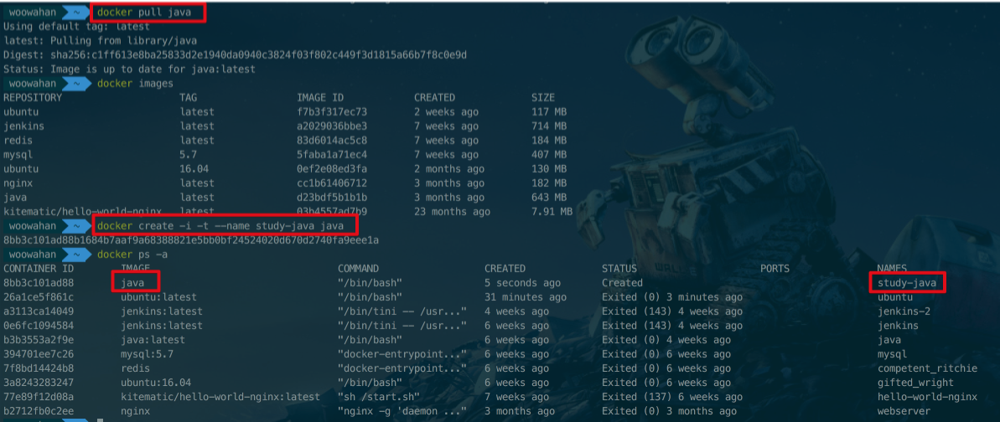
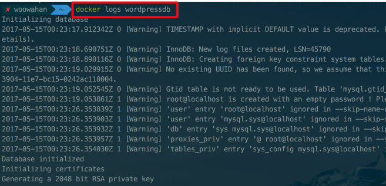

# 신림 프로그래머 도커 스터디

## 2장

### 테스트 환경 구축

* Java 이미지 Pull & 컨테이너 생성



* 컨테이너 실행 및 접속


* 컨테이너에 git 설치

```
apt-get update && apt-get install -y git
```

* 스프링부트 프로젝트 받기

```
git clone https://github.com/jojoldu/begin-docker.git
```

* mysql 이미지 받기 & 컨테이너 설치

```
docker run -d --name study-mysql -e MYSQL_ROOT_PASSWORD=study -e MYSQL_DATABASE=study mysql
```

### 용어정리

* 컨테이너
  * 격리된 공간에서 프로세스가 동작하는 기술
  * 가상화 기술의 하나지만 **기존 방식과 동일하지 않다**.
  * 프로세스 자체를 격리시키기 떄문에 CPU나 메모리는 딱 프로세스가 필요한 만큼만 추가로 사용
  * 기존 방식의 성능 문제를 해결

* 이미지 
  * 컨테이너 실행에 필요한 파일과 설정값 등을 포함하고 있는 것
  * 상태값이 변하지 않음 
  * 추가되거나 변하는 값은 **컨테이너에 저장**

* Dockerfile
  * 이미지 생성 과정을 작성한 것
  * Dockerfile에 작성된 내용을 토대로 이미지가 생성됨
  * 의존성 패키지, 설정파일 생성등 모든 것을 관리

### 명령어

* CLI


도커 커맨드를 입력하면 도커 클라이언트가 도커 서버로 명령을 전송하고 결과를 받아 터미널에 출력

* 도커버전 확인
  * ```docker -v```

* 도커 전체 컨테이너 확인
  * ```docker ps -a```

* 도커 다운로드 및 실행
  * ```docker run```
  * 컨테이너에 호스트 포트 할당은 run 시에만 가능([참고](http://stackoverflow.com/questions/19335444/how-do-i-assign-a-port-mapping-to-an-existing-docker-container))

* 컨테이너 전체 정지
  * ```docker stop $(docker ps -a -q)```
* 컨테이너 전체 삭제
  * ```docker rm $(docker ps -a -q)```

* 명령어 옵션


### 간단 컨테이너 사용하기

**ubuntu 16.04**

* ubuntu 16.04 실행

```
docker run ubuntu:16.04
```


* 실행시킨 컨테이너 내부로 접속

```
docker run --rm -it ubuntu:16.04 /bin/bash
```


* 컨테이너 나오기

```
exit
```

**redis** 

* redis 접속

```
docker run -d -p 9000:6379 redis
```


* 위 처럼 실행할 경우 백그라운드에서 redis 컨테이너가 구동된다.
* localhost:9000를 redis 컨테이너의 6379 포트로 연결하여 localhost:9000으로 접속시 redis를 사용할 수 있다.


* 나올때는 ```quit```를 입력하면 된다.

**mysql**

* ```-e```옵션으로 환경변수 설정하여 실습

```
docker run -d -p 3306:3306 -e MYSQL_ALLOW_EMPTY_PASSWORD=true --name mysql mysql:5.7
```


* password없이 root 계정 생성을 위해 ```MYSQL_ALLOW_EMPTY_PASSWORD ``` 옵션 지정

* 컨테이너 이름은 ```mysql```로 지정


### 도커 링크

각 컨테이너가 하나의 모듈만 가지게 하고, (스프링부트, MySQL 등에 각각 컨테이너 할당) 서로가 접근할수 있는 옵션은 ```--link```이다. 

```
docker run -d [생성할 컨테이너명] --link [컨테이너이름:별칭] -p [호스트포트]:[컨테이너포트] [이미지명]
```

* 예시

```
docker run -d --name sillim-study-java --link study-mysql:mysql -p 9000:8080 jojoldu/sillim-study-java:0.0
```


### 도커 볼륨

도커 이미지로 컨테이너를 생성하면 이미지는 **읽기 전용**이 되며 **변경 사항은 컨테이너**에서 관리한다.  
즉, 컨테이너 삭제할 경우 MySQL 컨테이너와 같이 데이터베이스의 저장된 데이터도 함께 삭제가 된다.  
이를 해결하기 위해 도커 볼륨으로 **호스트 컴퓨터에 저장**하는 기능을 사용한다.

```
docker run -d -v [호스트 디렉토리 위치]:[컨테이너 디렉토리 위치]
```

> /var/lib/mysql은 MySQL의 기본 데이터 저장위치입니다.


> -v옵션은 호스트의 디렉토리를 컨테이너의 디렉토리에 마운트합니다.

### 도커 이미지 배포

* [링크](https://hub.docker.com/)에 접속하여 회원가입 & 로그인 후, ```create repository``` 선택

* 배포하길 원하는 **컨테이너의 name**을 지정하여 배포

```
docker commit [로컬컨테이너 이름] [본인계정명]/[이미지 이름]:[버전]
```

예시)


* CLI에서 도커허브 로그인


* 도커 배포

```
docker push [본인계정명]/[이미지 이름]:[버전]
```


이후부터는 다른 이미지를 사용하는것과 동일하게 사용하면 된다.  
(단, latest가 적용된게 아니라서 이미지 이름 뒤에 항상 tag를 붙여야한다.)


### 도커 컨테이너 로그

* 컨테이너 로그 확인
  * ```docker logs [컨테이너명]```



기본적으로 확인하는 것외에 컨테이너의 로그를 여러 로깅 드라이버로 연결시켜줄 수도 있다

* syslog
  * ```docker run -d --log-driver=syslog [이미지]```
  * ex) ```docker run -d --name syslog --log-driver=syslog ubuntu:14.04```
  * 호스트 (즉, 컨테이너가 설치된 PC)의 운영체제가 맥OS라면 ```/var/log/system.log```에 저장된다
  * 우분투 14.04 : ```/var/log/syslog```, CentOS : ```/var/log/messages```에 저장된다.

### 이미지 생성 및 배포

* 이미지 생성

```
docker commit -a [작성자] -m [메세지] [로컬 컨테이너 이름]  [생성할 이미지 이름 및 태그]
```


* 이미지 푸시


### 첨부자료

* [발표자료](https://github.com/jojoldu/begin-docker)
* [이미지 주소](https://hub.docker.com/r/jojoldu/sillim-study-java/tags/)
* [젠킨스+슬랙+도커](http://jojoldu.tistory.com/139)